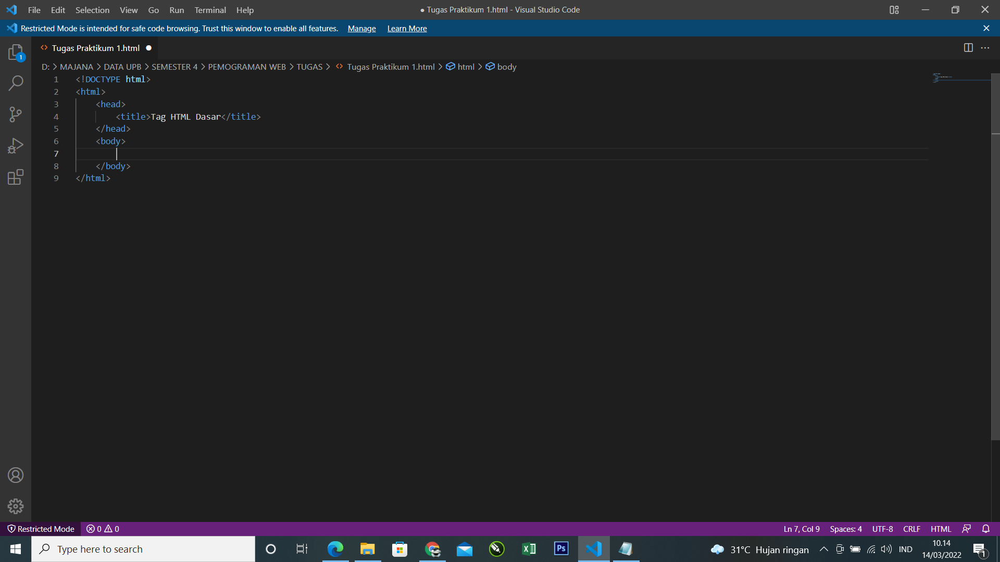
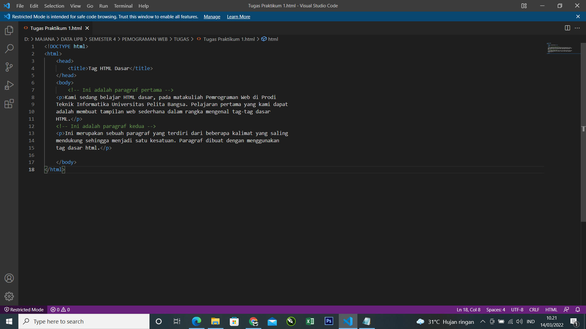
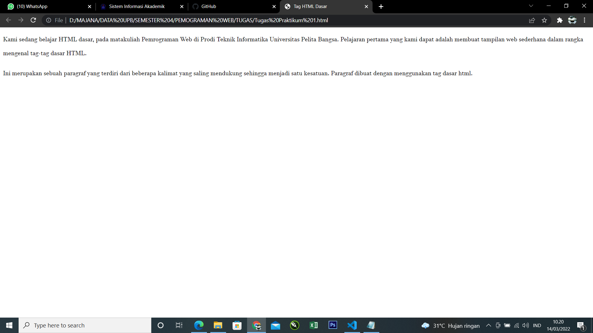
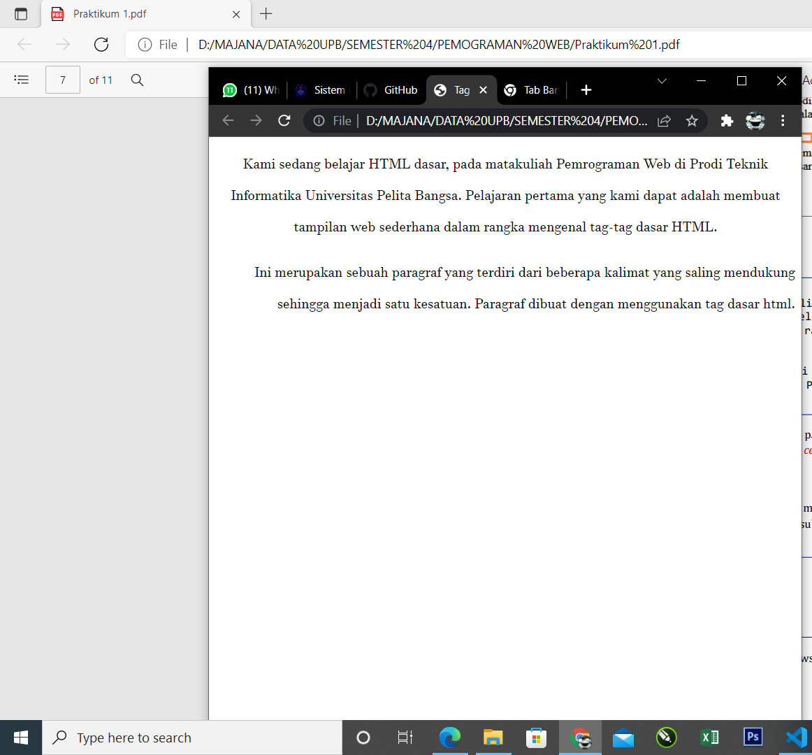
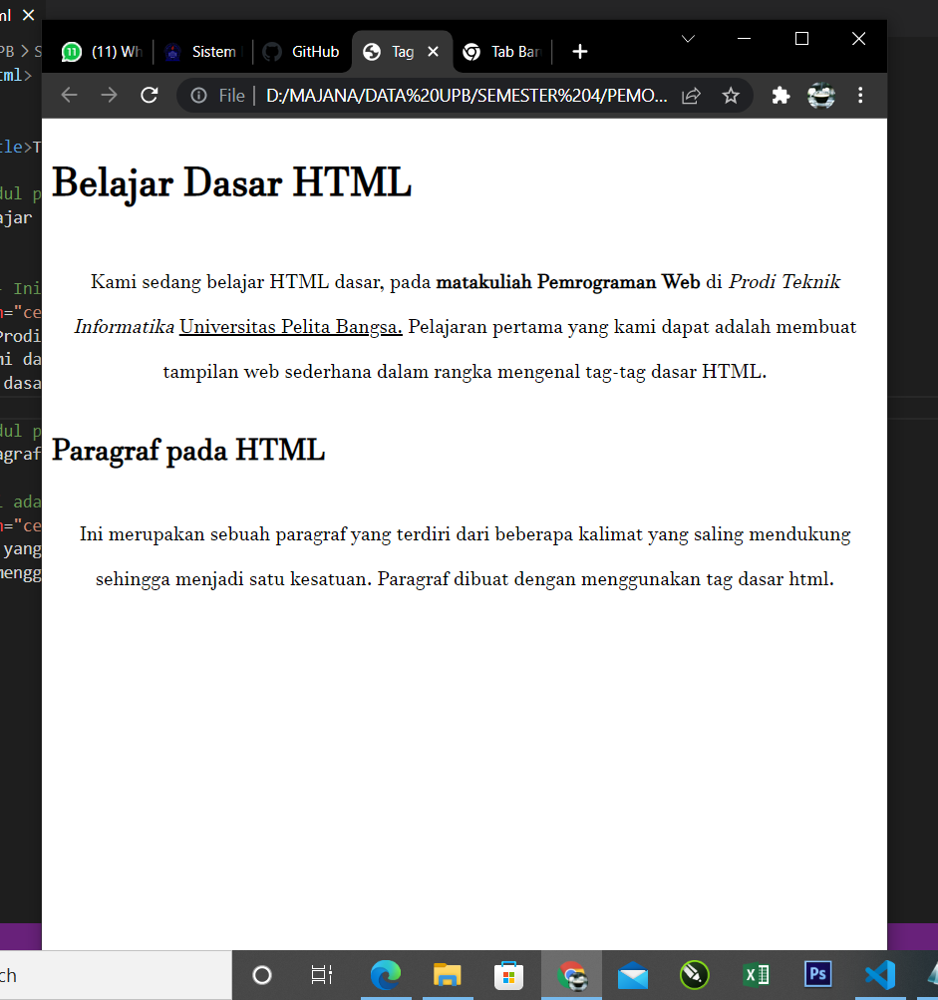
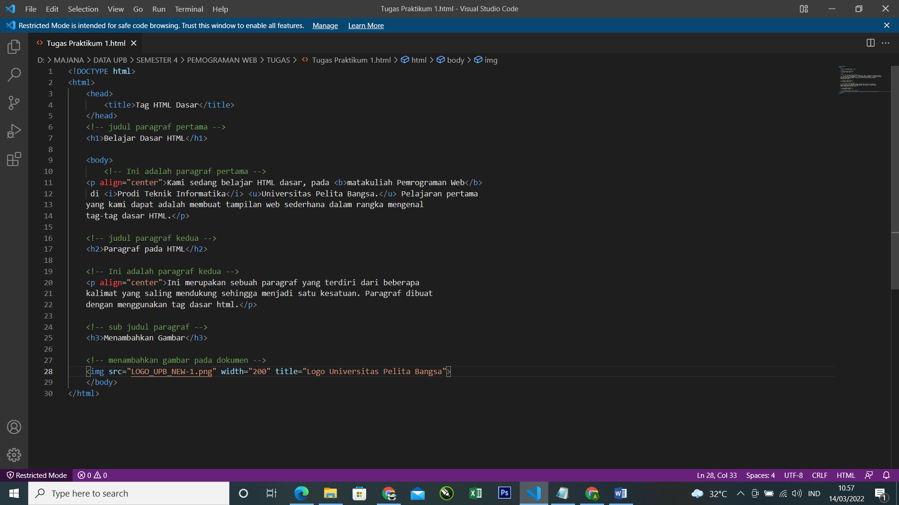
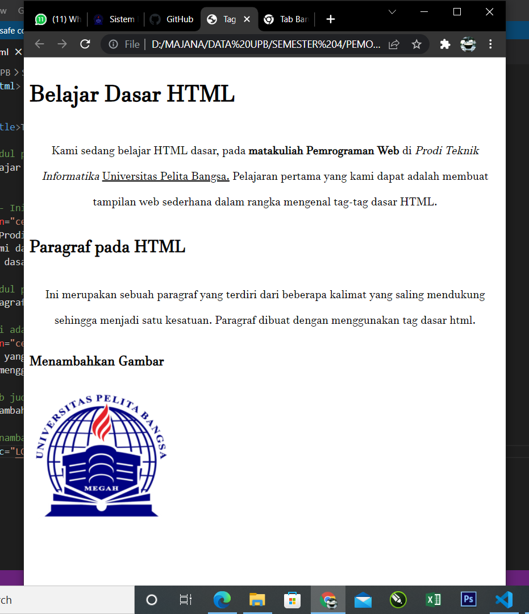

# -Lab1Web

## Jawaban dari Pertanyaan

- Jawaban 
    1.	Ya ada error ketika terjadi kesalahan
    2.	Tag 
 untuk memberikan perintah pada paragraf Tag   untuk memberikan perintah barisan baru 
    3.	Atribut title pada img yaitu atribut yang digunakan untuk memberikan judul pada gambar/tag gambar.
        Atribut alt pada img yaitu atribut yang bisa digunakan ketika gambar tidak dapat ditemukan
    4.	Perlu diisi supaya ukurannya tampilannya lebih baik atau profersional
    5.	jawaban
        a.	_blank – akan terjadi perubahan pada tab atau jendela baru yang telah ditautkan
        b.	_self – akan terjadi ketika membuka dokumen yang ditautkan di jendela atau tab yang sama seperti yang diklik
        c.	_top – ketika membuka dokumen yang ditautkan di seluruh jendela
        d.	_parent – ketika membuka dokumen yang ditautkan dalam bingkai induk

## Hasil Praktikum 1
- Koding Halaman Judul

- Tampilan pada Browser

- Koding Judul Paragraf

- Tampilan Pada Browser

- Koding Format Text

- Tampilan Pada Browser

- Koding Sub Judul Paragraf

- Tampilan Pada Browser

- Koding Menambahkan poto

- Tampilan Pada Browser

